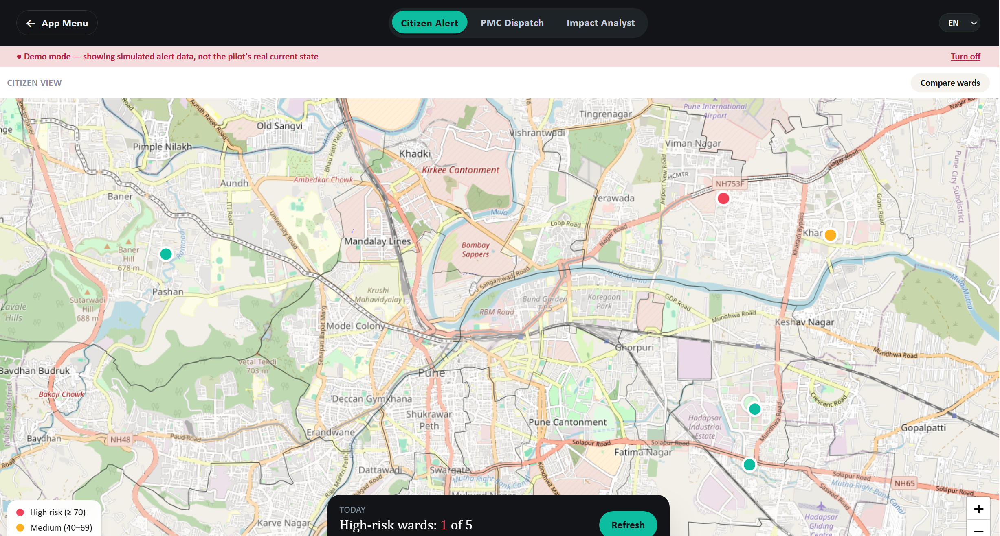
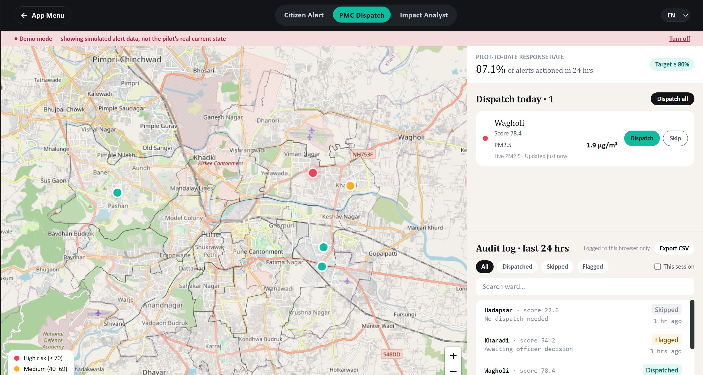
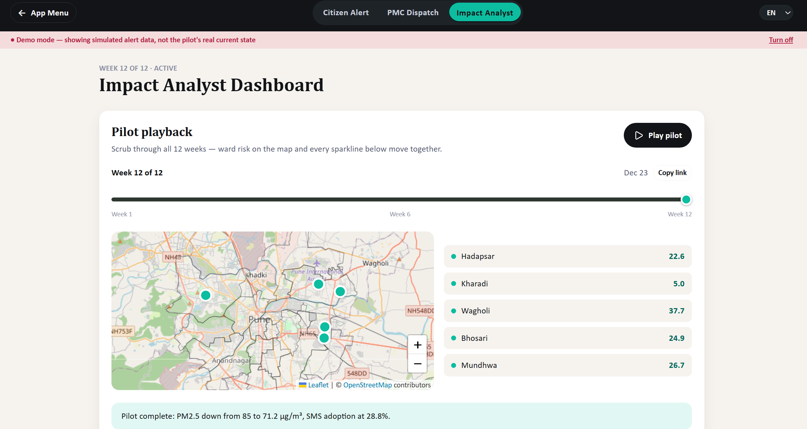
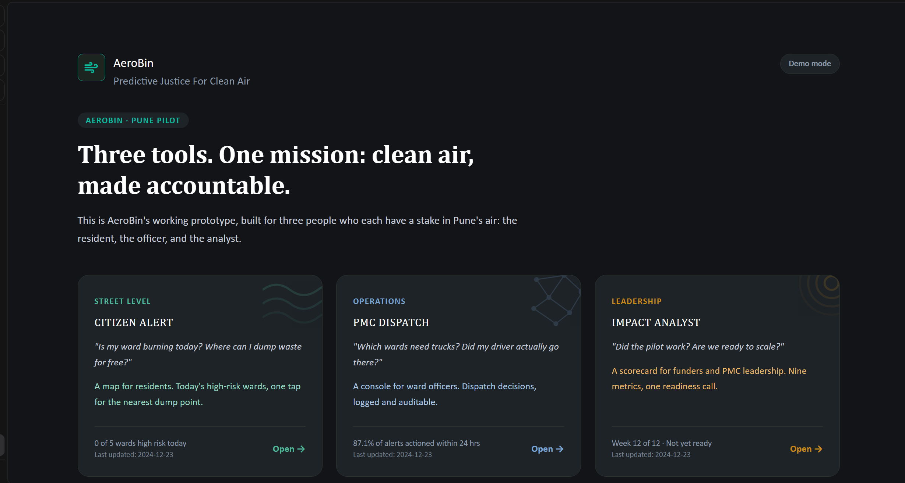

# AeroBin Micro-Apps

**Three tools. One mission: clean air, made accountable.**

> **Live demo:** [https://aerobin.vercel.app](https://aerobin.vercel.app) — deployed on Vercel (see *Deployment* below).

*Internship portfolio project — 1M1B Green Skills and Applied AI for Climate Action.*

A 12-week Pune pilot (Oct–Dec, 5 wards) for open waste burning early warning — built as three focused micro-apps on one shared dataset so they never disagree. Tagline: **Predictive Justice For Clean Air** (`src/pages/AppMenu.jsx:65`).

| App | Route | For | Question it answers |
|-----|-------|-----|---------------------|
| **Citizen Alert** | `/citizen` | Residents | Is my ward burning today? Where do I dump waste for free? |
| **PMC Dispatch** | `/dispatch` | Ward officers | Which wards need a truck? Did we log the decision? |
| **Impact Analyst** | `/analyst` | Funders / PMC leadership | Did the pilot work? Are we ready to scale? |






Landing at `/` links to all three; each app has a back-to-menu pill and a tab switcher (`src/components/TopNav.jsx:29`).

> Screenshots are in `SS/` and render above on GitHub. Replace any PNG to update.

---

## What is AeroBin & Why It Exists

Open burning of mixed waste spikes PM2.5 with no warning and no accountability trail for the PMC. AeroBin is a simulated pilot on **5 real Pune wards** — Hadapsar, Kharadi, Wagholi, Bhosari, Mundhwa — deliberately mixed by income/market/sensor coverage (not just best-instrumented areas), built on CPCB 2022-24 baselines. Data lives in `public/data/aerobin_data.json:1-43` (12 weeks `Week 1`–`Week 12`, Oct 7–Dec 23) and `pune-admin-wards.geojson` (city context layer, `src/lib/useWardGeoJSON.js:1-36`).

**Goals:**
1. **Early warning** for residents before burning happens (burn-risk score 0–100, `src/lib/theme.js:47-51` red ≥70 / amber 40–69 / teal Low).
2. **Auditable dispatch** for officers — every truck/skip decision logged, replayable (`src/lib/auditLog.js:1-102` `localStorage`).
3. **Scale readiness** — does the pilot justify replication to Nagpur? (`src/pages/ImpactAnalyst.jsx:105-151`).

9 ESG metrics track it: PM2.5 reduction, waste diverted, fuel saved, respiratory rate, SMS adoption, equity gap, audit trail, PMC response rate, open data (`docs/DATA_MODEL.md` for the table and `src/lib/esgStatus.js:1-48` for how green/amber/red is derived).

---

## Key Features

*   **Demo Mode** (`src/lib/demoOverrides.js:24-39`) — toggle top-right of landing page: forces Wagholi 78.4 High + Kharadi 54.2 Medium + `S3_equityGap:12.6` red, shows all three map legend tiers and the only red ESG state the real pilot never has. Pure runtime overlay (deep-clone, `DemoContext.js:1-3` + `DemoProvider.jsx:10-25`), `clearAuditLog()` on every toggle so dispatch is replayable. Banner `TopNav.jsx:49-58` reminds you it’s simulated.
*   **Pilot Playback** (`src/components/PilotPlayback.jsx:1-164`) — scrub all 12 weeks; mini-map + ward list + every ESG sparkline’s tracking dot move together at 2.5s/week, ticks per week behind the thumb (`src/index.css:277-291`).
*   **Live PM2.5** (`src/lib/useWeather.js:1-114`) — OpenWeatherMap Air Pollution API per ward, module `Map` cache across tab navigation; fallback to `E1_pm25.current` with amber “Last known reading” via `src/components/LiveReading.jsx:15-43` (no silent fake live).
*   **Dispatch Queue + Audit Log** (`src/pages/DispatchConsole.jsx:1-260`) — sorted High-risk desc, map↔queue selection sync (`LeafletMap.jsx:50-104` `selectedWardId/onSelectWard`), hover tooltip with top feature + dispatch status, audit seeded from real `dispatchStatus` and persisted.
*   **Mobile Citizen** — below 640px floating `Popup` → `BottomSheet.jsx:11-27` sheet with backdrop + dialog a11y (`src/pages/CitizenAlert.jsx:42-126`).

See `docs/CONTRAST_FIX.md` and `docs/DATA_MODEL.md` for the deep dives that used to live here.

---

## Tech Stack

React 19 + Vite 8 + `react-router-dom:7.18.1` (lazy chunks per app `src/App.jsx:12`), Leaflet `1.9.4` + `react-leaflet:5.0.0`, Recharts `3.10.0`, Tailwind v4 `@theme` `src/index.css:9-42` + `src/lib/theme.js:6-26` as single truth, `lucide-react` icons. Lint: `oxlint` `^1.71.0` (`npm run lint`).

---

## Getting Started

```bash
npm install
npm run dev      # http://localhost:5173
npm run build    # dist/
npm run preview  # serve build
npm run lint
```

**Live PM2.5:**
- **Deployed site (Vercel):** reads `VITE_OPENWEATHER_API_KEY` from the Vercel environment variable (set once in Project → Settings → Environment Variables) — live PM2.5 on the demo.
- **Local dev (optional):**
```bash
cp .env.example .env.local
# edit .env.local → VITE_OPENWEATHER_API_KEY from https://openweathermap.org/api
# without a key the app still works on pilot baseline (honest amber fallback)
```

---

## Deployment (Vercel)

Free Hobby tier, zero config — the repo already includes `vercel.json` (SPA rewrite with filesystem-first, so `/data/*`, `/sw.js`, `/manifest.json` serve real files while app routes fall back to `index.html`).

1. vercel.com → Add New → Project → Import this repo → Vite preset auto-detected
2. Environment Variables → `VITE_OPENWEATHER_API_KEY` = your key (Production + Preview)
3. Deploy → every future `git push` to `main` auto-redeploys

Requires Node `>=18` (`package.json:6` `engines`, `.nvmrc:1` `20`). See `jsconfig.json` for `checkJs` IDE hints (Option A — no TS migration).

---

## How “Today” Stays Honest

Week 12 (Dec 23) has all wards Low (<40) — `summary.highRiskWardsToday:0` in `aerobin_data.json:49`. Citizen shows “All wards below alert level” banner, Dispatch shows “No wards above threshold” empty state (`CitizenAlert.jsx:64-65`, `DispatchConsole.jsx:165`). Bump any `current.burnRiskScore` >70 in `public/data/aerobin_data.json` and a pulsing red marker appears instantly — logic is in `theme.js:47-56` `riskBandForScore`. History is only in Analyst’s Playback, which is its job.

---

## Design Decisions (Summary)

*   **Cascade fix:** unlayered `h1 {color:navy}` beat Tailwind `text-white` (`@layer utilities` loses to unlayered per spec). Fixed by wrapping resets in `@layer base` `src/index.css:66-88` + explicit hex on brief-critical text `AppMenu.jsx:14`/`LiveReading.jsx` — see `docs/CONTRAST_FIX.md`.
*   **Text-safe colors:** vivid `#FFB020`/`#F0435A`/`#00D4AA` fail WCAG as text (1.65:1); darker `amberText #8A5A00`/`redText #B42245`/`tealText #00695A` pass 5.6–6.6:1 on white/mist — see `docs/CONTRAST_FIX.md`.

---

## Project Structure

```
src/
  components/ TopNav.jsx, Card.jsx, LeafletMap.jsx, Sparkline.jsx, PilotPlayback.jsx,
              LiveReading.jsx, BottomSheet.jsx, CardAccentArt.jsx, StateScreen.jsx, ErrorBoundary.jsx
  lib/        useAerobinData.js, useWardGeoJSON.js, useWeather.js, useIsMobile.js,
              DemoContext.js/DemoProvider.jsx/useDemoMode.js, demoOverrides.js,
              theme.js, esgStatus.js, auditLog.js, exportReport.js, format.js,
              i18n.jsx, registerSW.js
  pages/      AppMenu.jsx, CitizenAlert.jsx, DispatchConsole.jsx, ImpactAnalyst.jsx
public/       leaf.svg, manifest.json, sw.js, data/ aerobin_data.json, pune-admin-wards.geojson
Project Submissions/  1A–4B docs, Prototype Video.mkv (65 MB, direct push), Portfolio pptx
docs/         CONTRAST_FIX.md, DATA_MODEL.md, ROADMAP.md
SS/           citizen-map.png, dispatch-queue.png, analyst-playback.png, landing.png
```

---

## Process Docs

`Project Submissions/` holds the 1A–4B process trail (Campus Audit → Indicator Mapping → Cleaned Dataset → Visualization → Smart Solution → AI Workflow → ESG Report → Scaling Strategy) plus `AeroBin-Project-Brief.md` (# Problem → Research → Solution → Impact → Next). Kept in the repo intentionally to show how the app was built, not just the final screens.

---

## Limitations & Next Steps

From `docs/ROADMAP.md`: needs live burn-detection feed (FIRMS/satellite or PMC data share), real backend vs `localStorage` for cross-officer audit, and closing `S2_smsAdoption` gap (28.8% vs 50% target) before replication. See `docs/ROADMAP.md` for the prioritized backlog (C12 bulk dispatch, C13 audit search, D20 CSV export, F26-30 compare/history/i18n/PWA).

---

## Rights

© 2026 Zaid Khan — All rights reserved. View-only. No reuse licence granted. Contact author for permission. Data is simulated (CPCB 2022-24 baselines, `meta.dataType` in `aerobin_data.json:5`).

---

## Shared Architecture Notes

- **Data** `useAerobinData`/`useWardGeoJSON` fetch at runtime → malformed JSON shows `ErrorScreen` gracefully.
- **Weather** `useWeather` once-per-ward, `Map` cache, 8s `AbortController` timeout, honest `source:'fallback'`.
- **Theme** `index.css` + `theme.js` single truth; `APP_ACCENTS` (green/blue/gold) for landing cards only, separate from risk red/amber/teal.
- **Routing** lazy chunks (Leaflet vs Recharts split, `ErrorBoundary` around `Suspense` `App.jsx:14-21`).
- **Audit** seed from real `dispatchStatus`, `persistAuditLog`/`clearAuditLog` on demo toggle.
